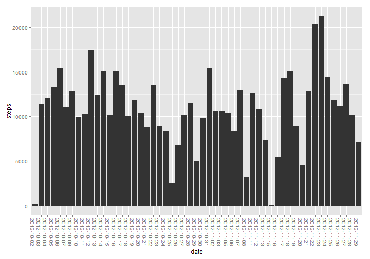
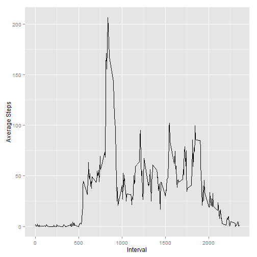
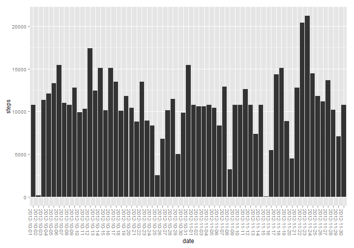
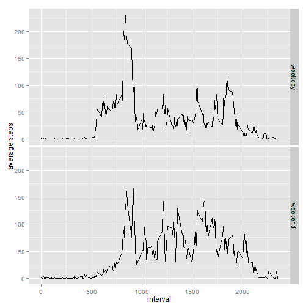

# Reproducible Research: Peer Assessment 1
  
This assignment makes use of data from a personal activity monitoring
device. This device collects data at 5 minute intervals through out the
day. The data consists of two months of data from an anonymous
individual collected during the months of October and November, 2012
and include the number of steps taken in 5 minute intervals each day.

The data for this assignment can be downloaded from the course web
site:

Dataset: [Activity monitoring data](https://d396qusza40orc.cloudfront.net/repdata%2Fdata%2Factivity.zip) [52K]

The variables included in this dataset are:

* **steps**: Number of steps taking in a 5-minute interval (missing
    values are coded as `NA`)

* **date**: The date on which the measurement was taken in YYYY-MM-DD
    format

* **interval**: Identifier for the 5-minute interval in which
    measurement was taken

## Loading and preprocessing the data

```r
require(lubridate)
require(dplyr)
require(ggplot2)
setwd("E:/datascience")
activity<-read.csv(file="RepData_PeerAssessment1/activity.csv",
	header=TRUE)
```
*****

## What is mean total number of steps taken per day?
For this part of the assignment, you can ignore the missing values in
the dataset.

Make a histogram of the total number of steps taken each day

```r
activityNoNA<-na.omit(activity)
activityByDay<-aggregate(activityNoNA$steps, list(activityNoNA$date),sum)
colnames(activityByDay)<-c("date", "steps")
  
activityPlot<-ggplot(data=activityByDay, aes(x=date,y=steps))+geom_bar(stat="identity") +
    theme(axis.text.x=element_text(angle=-90, hjust=0))
```

```r
print(activityPlot)
```

 
  
Calculate and report the **mean** and **median** total number of steps taken per day  


**Mean steps per day:** 10766  
**Median steps per day:** 10765
 
***** 
  
  
## What is the average daily activity pattern?
Make a time series plot (i.e. `type = "l"`) of the 5-minute interval (x-axis) and the average number of steps taken, averaged across all days (y-axis)  


```r
avgStepsInInterval<-aggregate(activityNoNA$steps, by=list(interval=activityNoNA$interval), 
                           mean)
```

```r
ggplot(data=avgStepsInInterval, aes(x=interval, y=x))+geom_line()+ylab("Average Steps")+xlab("Interval")
```

 

Which 5-minute interval, on average across all the days in the dataset, contains the maximum number of steps?  
**Average Max Steps Interval: **835

*****


## Imputing missing values  
Note that there are a number of days/intervals where there are missing
values (coded as `NA`). The presence of missing days may introduce
bias into some calculations or summaries of the data.

Calculate and report the total number of missing values in the dataset (i.e. the total number of rows with `NA`s)  

```r
totalNumberOfRows<-nrow(activity)
numberOfRowsWithoutNAs<-nrow(activityNoNA)
```
**Number of rows with 'NA's:** 2304
  

Devise a strategy for filling in all of the missing values in the dataset. The strategy does not need to be sophisticated. For example, you could use the mean/median for that day, or the mean for that 5-minute interval, etc.

Create a new dataset that is equal to the original dataset but with the missing data filled in.  


```r
# For each row, check for NA in steps column.
# If NA, then replace with value for that interval from avgStepsInInterval
# This value will be the mean of the five minute interval 
replacedNAs<-activity
replacedNAs$steps[is.na(replacedNAs$steps)]<-avgStepsInInterval$x
activityByDayWithValuesForNA<-aggregate(replacedNAs$steps, list(replacedNAs$date), sum)
colnames(activityByDayWithValuesForNA)<-c("date", "steps")  
```
Make a histogram of the total number of steps taken each day and Calculate and report the **mean** and **median** total number of steps taken per day. Do these values differ from the estimates from the first part of the assignment? What is the impact of imputing missing data on the estimates of the total daily number of steps?  


```r
ggplot(data=activityByDayWithValuesForNA, aes(x=date,y=steps))+geom_bar(stat="identity") +
    theme(axis.text.x=element_text(angle=-90, hjust=0))
```

 
   

  
**Mean number of total steps taken per day:** 10766  
**Median number of total steps taken per day:** 10766
  
Interestingly, there is almost no difference in the mean and media for the data set with 'NA's
excluded and the data set with 'NA's substituted with the average number of steps for those
intervals that had a value of NA.
 
*****
  
## Are there differences in activity patterns between weekdays and weekends?
Create a new factor variable in the dataset with two levels -- "weekday" and "weekend" indicating whether a given date is a weekday or weekend day.
  

```r
weekend<-c("Saturday", "Sunday")
weekdayVersusWeekend<-mutate(replacedNAs,
                             typeOfDay = ifelse(is.element(weekdays(ymd(date)), weekend),
                                                "weekend", "weekday"))
weekdayVersusWeekend$typeOfDay<-as.factor(weekdayVersusWeekend$typeOfDay)

dayOfTheWeekByInterval<-aggregate(weekdayVersusWeekend$steps, 
                           by=list(interval=weekdayVersusWeekend$interval,
                                   typeOfDay=weekdayVersusWeekend$typeOfDay), mean)
names(dayOfTheWeekByInterval)[names(dayOfTheWeekByInterval) == 'x']<- "steps"
```

Make a panel plot containing a time series plot (i.e. `type = "l"`) of the 5-minute interval (x-axis) and the average number of steps taken, averaged across all weekday days or weekend days (y-axis).  
  

```r
ggplot(data=dayOfTheWeekByInterval, aes(x=interval, y=steps)) + geom_line() + facet_grid(typeOfDay ~ .) + ylab("average steps")
```

 
